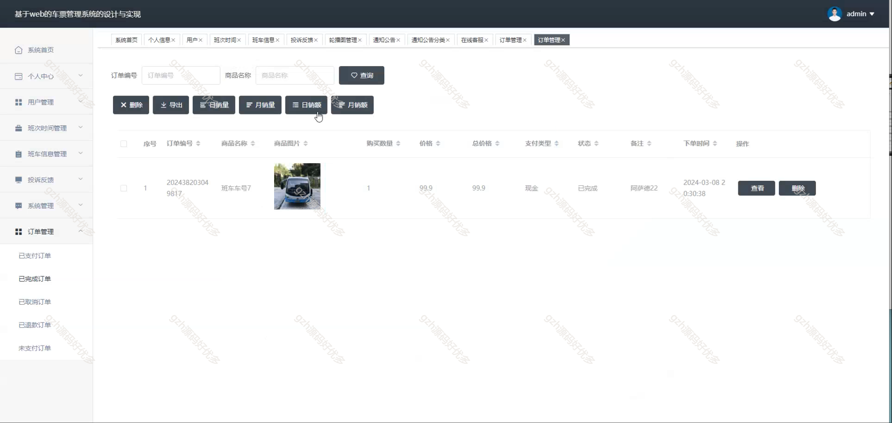
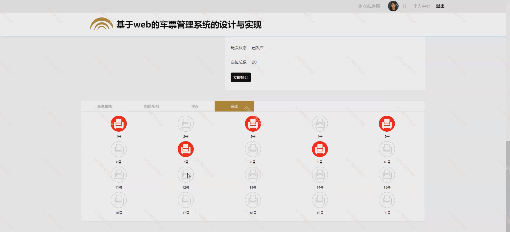
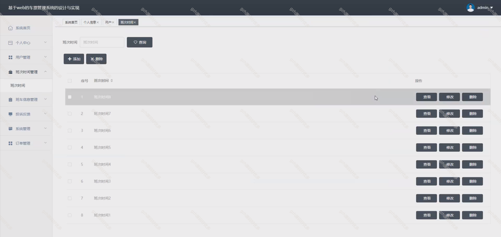
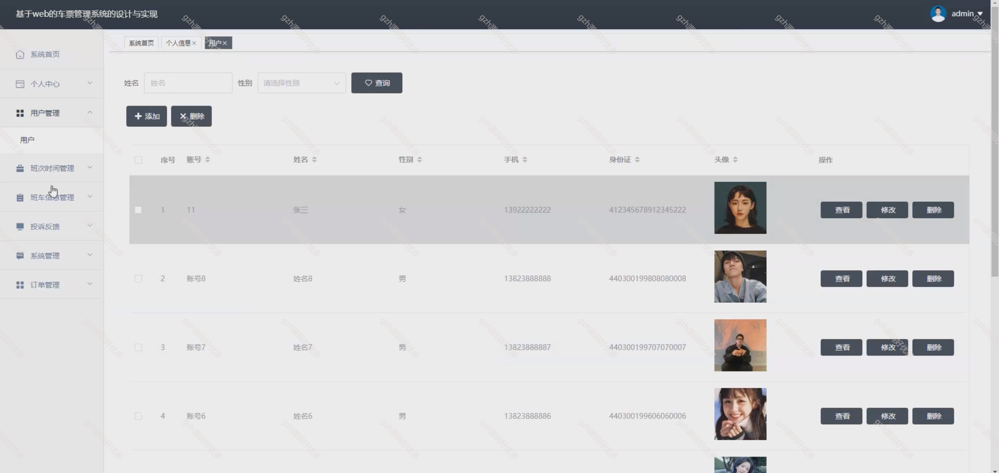
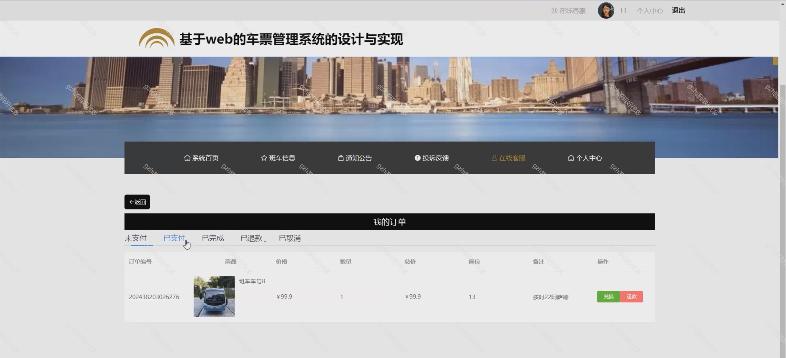
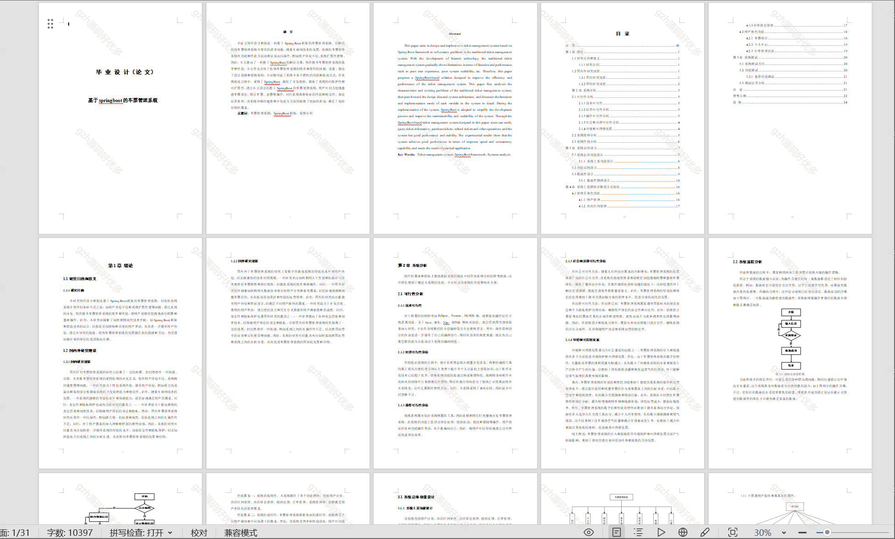
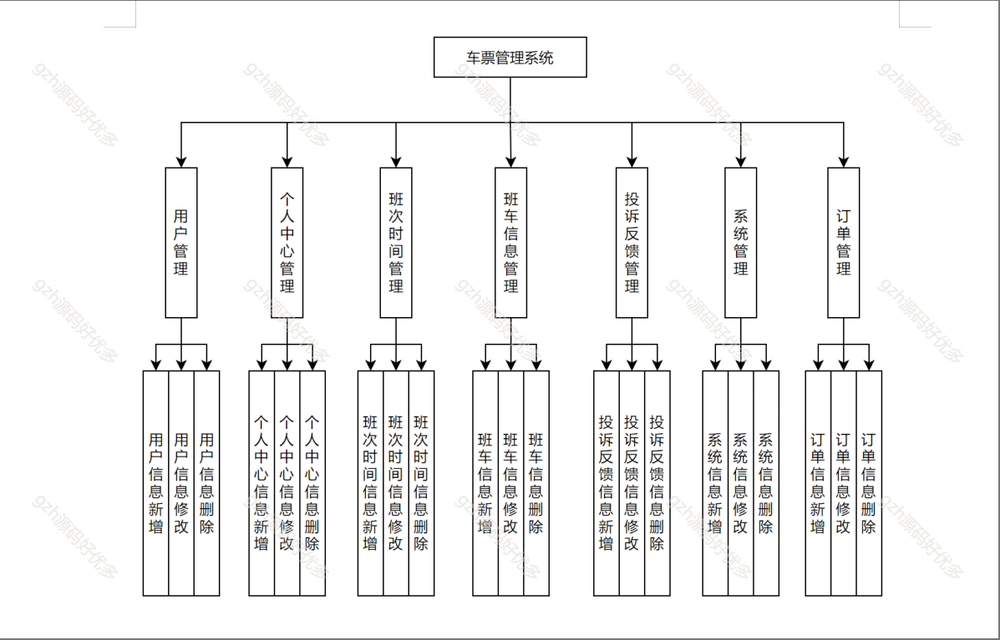
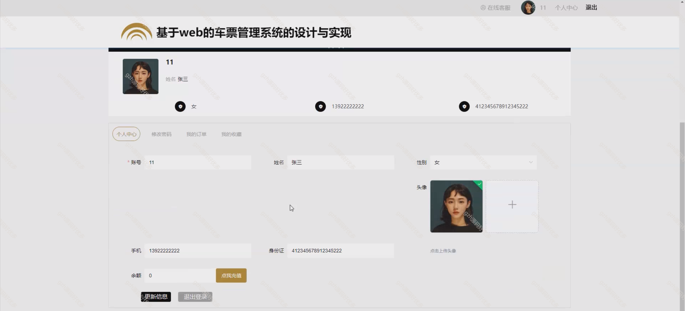
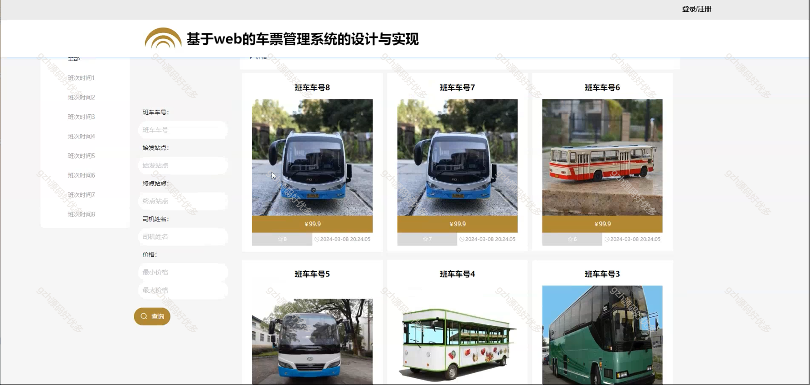

# springbootA360
springbootA360基于Java Springboot车票管理系统
 
## 查看主页获取源码

### 一、作品包含

源码+数据库+设计文档万字+全套环境和工具资源+部署教程

### 二、项目技术

前端技术：Html、Css、Js、Vue2.0、Element-ui 
数据库：MySQL
后端技术：Java、SpringBoot2.0、MyBatis

### 三、运行环境

开发工具：IDEA/eclipse  + vscode

数据库：MySQL5.7（最低要5.7版本）

数据库管理工具：Navicat10以上版本

环境配置软件： JDK1.8 + Maven3.6.3

前端Nodejs：14

浏览器：谷歌浏览器

### 四、项目介绍
项目编号：springbootA360

旨在设计和实现一种基于Spring Boot框架的车票管理系统，以解决传统车票管理系统中存在的诸多问题。随着互联网技术的发展，传统的车票管理系统在功能和性能方面逐渐显现出局限性，例如用户体验不佳、系统扩展性差等。因此，本文提出了一种基于SpringBoot的解决方案，旨在提升车票管理系统的效率和性能。本文首先分析了传统车票管理系统的特点和存在的问题，接着，提出了设计思路和系统架构，并详细讨论了系统中各个模块的功能和实现方式。在系统实现过程中，采用了SpringBoot，简化了开发流程，提高了系统的可维护性和可扩展性。通过本文设计的基于SpringBoot的车票管理系统，用户可以方便地查询车票信息、购买车票、退票等操作，同时系统具有良好的性能和稳定性。实验结果表明，该系统在响应速度和并发能力方面均取得了较好的表现，满足了实际应用的需求。

### 五、运行截图

  
